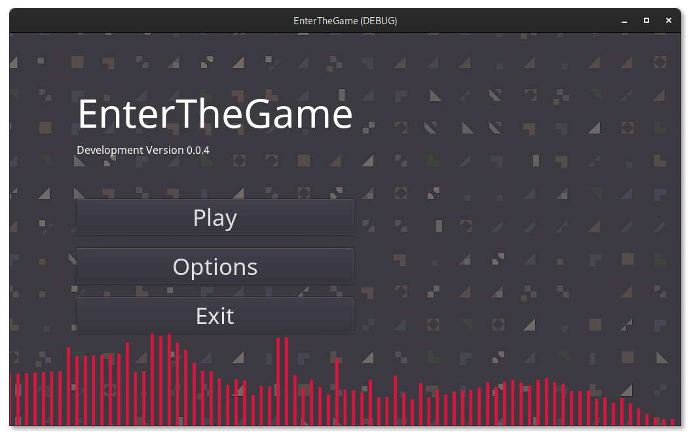

# EnterTheGame
**EnterTheGame is a 2D platformer game written in Godot.** It will feature
multiple levels, a great soundtrack, obstacles and a boss battle.
This is still in active development and the game is not completed yet.

## Installation
You can download binaries for your operating system [here.](https://github.com/NuceSoftware/EnterTheGame/releases)

**On Windows:** Download the exe file and run it.

**On MacOS:** Extract the .zip file, right click on the package and run it.

**On Linux:** Give it executable permissions with `chmod +x ./linux.x86_64`, then
run the exectuable with `./linux.x86_64`
